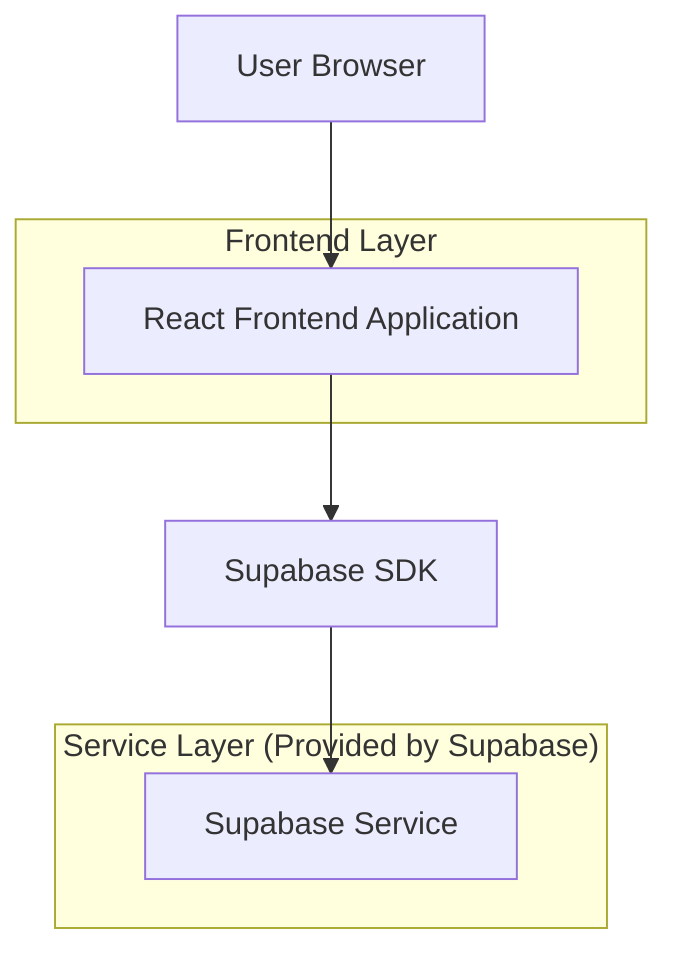
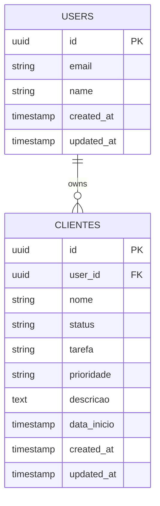

# Arquitetura Técnica - Plataforma de Gerenciamento de Clientes

## 1. Architecture design



## 2. Technology Description
- Frontend: React@18 + tailwindcss@3 + vite + lucide-react
- Backend: Supabase (Authentication + Database)

## 3. Route definitions

| Route | Purpose |
|-------|---------|
| /login | Página de login com autenticação Supabase |
| /dashboard | Dashboard principal com lista de clientes em accordion |
| /cliente/novo | Formulário para cadastrar novo cliente |
| /cliente/editar/:id | Formulário para editar cliente existente |
| /perfil | Página de configurações do usuário |

## 4. API definitions
Como utilizamos Supabase, as operações são realizadas através do SDK client-side. Principais operações:

### 4.1 Autenticação
```typescript
// Login
supabase.auth.signInWithPassword({ email, password })

// Logout  
supabase.auth.signOut()

// Verificar sessão
supabase.auth.getSession()
```

### 4.2 Operações de Clientes
```typescript
// Buscar todos os clientes
supabase.from('clientes').select('*').eq('user_id', userId)

// Criar novo cliente
supabase.from('clientes').insert([clienteData])

// Atualizar cliente
supabase.from('clientes').update(clienteData).eq('id', clienteId)

// Deletar cliente
supabase.from('clientes').delete().eq('id', clienteId)
```

## 5. Data model

### 5.1 Data model definition



### 5.2 Data Definition Language

Tabela de Clientes (clientes)
```sql
-- Criar tabela de clientes
CREATE TABLE clientes (
    id UUID PRIMARY KEY DEFAULT gen_random_uuid(),
    user_id UUID REFERENCES auth.users(id) ON DELETE CASCADE,
    nome VARCHAR(255) NOT NULL,
    status VARCHAR(50) NOT NULL CHECK (status IN ('Fixo', 'Em andamento', 'Aguardando feedback', 'Pausado', 'Concluído')),
    tarefa TEXT NOT NULL,
    prioridade VARCHAR(20) NOT NULL CHECK (prioridade IN ('High', 'Normal', 'Low')),
    descricao TEXT,
    data_inicio DATE DEFAULT CURRENT_DATE,
    created_at TIMESTAMP WITH TIME ZONE DEFAULT NOW(),
    updated_at TIMESTAMP WITH TIME ZONE DEFAULT NOW()
);

-- Criar índices para performance
CREATE INDEX idx_clientes_user_id ON clientes(user_id);
CREATE INDEX idx_clientes_status ON clientes(status);
CREATE INDEX idx_clientes_prioridade ON clientes(prioridade);
CREATE INDEX idx_clientes_created_at ON clientes(created_at DESC);

-- Configurar RLS (Row Level Security)
ALTER TABLE clientes ENABLE ROW LEVEL SECURITY;

-- Política para usuários autenticados verem apenas seus próprios clientes
CREATE POLICY "Users can view own clientes" ON clientes
    FOR SELECT USING (auth.uid() = user_id);

CREATE POLICY "Users can insert own clientes" ON clientes
    FOR INSERT WITH CHECK (auth.uid() = user_id);

CREATE POLICY "Users can update own clientes" ON clientes
    FOR UPDATE USING (auth.uid() = user_id);

CREATE POLICY "Users can delete own clientes" ON clientes
    FOR DELETE USING (auth.uid() = user_id);

-- Conceder permissões básicas
GRANT SELECT ON clientes TO anon;
GRANT ALL PRIVILEGES ON clientes TO authenticated;

-- Dados iniciais de exemplo (opcional)
INSERT INTO clientes (user_id, nome, status, tarefa, prioridade, descricao, data_inicio) VALUES
('00000000-0000-0000-0000-000000000000', 'Kotai Project', 'Fixo', 'Desenvolvimento de aplicativo mobile', 'High', 'Projeto de desenvolvimento completo com funcionalidades avançadas', '2024-01-15'),
('00000000-0000-0000-0000-000000000000', 'Up Room', 'Fixo', 'Sistema de chat com funcionalidades especiais', 'High', 'Chat com mensagens diretas, grupos e tópicos', '2024-02-01');
```