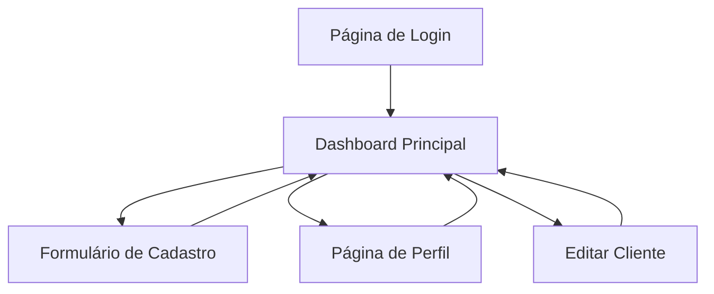

# Plataforma de Gerenciamento de Clientes

## 1. Product Overview
Uma plataforma web simples e intuitiva para gerenciamento de clientes ativos, permitindo cadastro, visualização e acompanhamento do status de projetos de forma organizada.
- Substitui o uso do Notion para gerenciamento de clientes, oferecendo uma interface dedicada e otimizada para essa finalidade específica.
- Voltada para freelancers, pequenas agências ou profissionais que precisam acompanhar múltiplos projetos de clientes simultaneamente.

## 2. Core Features

### 2.1 User Roles
Não há distinção de papéis - sistema de usuário único com autenticação simples.

### 2.2 Feature Module
Nossa plataforma de gerenciamento de clientes consiste nas seguintes páginas principais:
1. **Página de Login**: autenticação via Supabase, recuperação de senha.
2. **Dashboard Principal**: visualização em accordion dos clientes ativos, filtros por status e prioridade.
3. **Formulário de Cadastro**: adição de novos clientes com todos os campos necessários.
4. **Página de Perfil**: configurações básicas do usuário.

### 2.3 Page Details

| Page Name | Module Name | Feature description |
|-----------|-------------|---------------------|
| Página de Login | Autenticação | Login com email/senha via Supabase, opção "Lembrar-me", link para recuperação de senha |
| Dashboard Principal | Lista de Clientes | Exibir clientes em formato accordion com dados resumidos (nome, status, prioridade), expandir para mostrar detalhes completos |
| Dashboard Principal | Filtros e Busca | Filtrar por status (Fixo, Em andamento, Aguardando feedback, Pausado, Concluído), filtrar por prioridade (High, Normal, Low), busca por nome |
| Dashboard Principal | Ações Rápidas | Botão para adicionar novo cliente, editar cliente existente, alterar status rapidamente |
| Formulário de Cadastro | Cadastro de Cliente | Campos: nome do cliente, status, tarefa/projeto, prioridade, descrição detalhada, data de início |
| Formulário de Cadastro | Validação | Validar campos obrigatórios, feedback visual de erros, confirmação de salvamento |
| Página de Perfil | Configurações | Alterar dados pessoais, logout, configurações de notificação |

## 3. Core Process
**Fluxo Principal do Usuário:**
1. Usuário acessa a plataforma e faz login via Supabase
2. É direcionado para o Dashboard onde visualiza todos os clientes em formato accordion
3. Pode filtrar clientes por status ou prioridade para encontrar informações específicas
4. Para adicionar novo cliente, clica no botão "+" e preenche o formulário
5. Pode expandir qualquer accordion para ver detalhes completos do projeto
6. Pode editar informações ou alterar status diretamente do accordion

## 4. User Interface Design
### 4.1 Design Style
**Tema Dark Completo:**
- **Background principal**: #0f172a (slate-900) - fundo da aplicação
- **Background secundário**: #1e293b (slate-800) - áreas de conteúdo
- **Background cards**: #334155 (slate-700) - cards e componentes
- **Texto principal**: #f8fafc (slate-50) - textos principais
- **Texto secundário**: #cbd5e1 (slate-300) - textos secundários e labels
- **Bordas**: #475569 (slate-600) - bordas sutis entre elementos
- **Cor primária**: #3b82f6 (blue-500) - botões e links principais
- **Success**: #10b981 (emerald-500) - status positivos e confirmações
- **Warning**: #f59e0b (amber-500) - alertas e status de atenção
- **Error**: #ef4444 (red-500) - erros e alta prioridade
- **Estilo de botões**: Arredondados (rounded-lg), com hover effects sutis para tema dark
- **Tipografia**: Inter ou similar, 14px para texto base, 18px para títulos, sempre em cores claras
- **Layout**: Cards escuros com bordas sutis, sombras reduzidas, espaçamento generoso
- **Ícones**: Lucide React ou Heroicons em cores claras (#cbd5e1), estilo outline

### 4.2 Page Design Overview

| Page Name | Module Name | UI Elements |
|-----------|-------------|-------------|
| Página de Login | Formulário de Login | Card escuro centralizado (bg-slate-800), campos com background slate-700 e texto claro, botão azul principal com hover sutil, link de recuperação em slate-300 |
| Dashboard Principal | Accordion de Clientes | Cards expansíveis escuros (bg-slate-700) com bordas slate-600, header com nome em texto claro + status badges coloridos + prioridade, animação suave de expansão, hover com bg-slate-600 |
| Dashboard Principal | Barra de Filtros | Dropdowns com background slate-700 e texto claro, campo de busca escuro com ícone em slate-300, botão "Adicionar Cliente" azul destacado sobre fundo escuro |
| Formulário de Cadastro | Formulário | Layout em duas colunas sobre fundo slate-800, campos com background slate-700 e bordas slate-600, labels em slate-300, textarea escura, botões de ação contrastantes no rodapé |

### 4.3 Responsiveness
Desktop-first com adaptação mobile completa. Interface otimizada para touch em dispositivos móveis, com accordion facilmente expansível por toque.